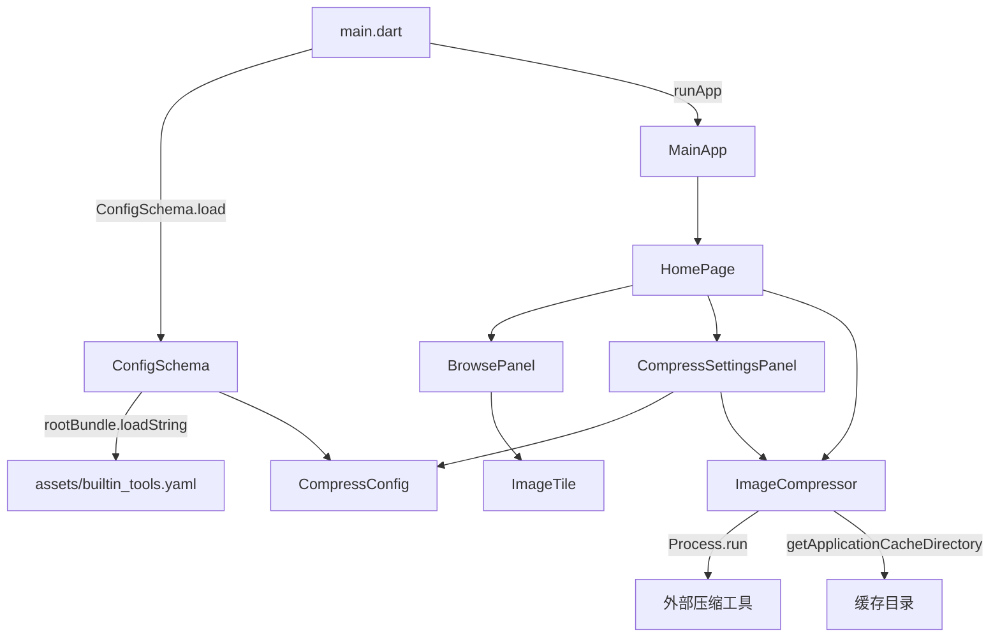

# Byte Treasurer

JPG图片批量压缩工具, 支持拖放导入, 批量选择, 压缩/原图切换预览, 可视化参数配置.

## 关键假设

- 仅支持JPG/JPEG格式
- 压缩工具通过YAML配置文件声明, 使用Jinja2模板渲染命令行参数
- 压缩后文件存储在应用缓存目录 (`~/.cache/byte_treasurer/compressed/`), 不覆盖原文件

## 计划

- FIXME
  - 压缩预览需移动到压缩设置面板顶部, 且预览图需要更大.
  - 预览中原始大小显示为0B, 导致压缩率显示为无穷.
- TODO
  - 更换状态管理组件
## 快捷键

| 功能 | 快捷键 | Intent |
|------|--------|--------|
| 全选 | Ctrl+A | `SelectAllIntent` |
| 取消选择 | Esc | `ClearSelectionIntent` |
| 放大 | Ctrl+= / Ctrl++ / Ctrl+NumpadAdd | `ZoomIntent.zoomIn()` |
| 缩小 | Ctrl+- / Ctrl+NumpadSubtract | `ZoomIntent.zoomOut()` |
| 单选 | 左键 | - |
| 切换选中 | Ctrl+左键 | - |
| 范围选择 | Shift+左键 | - |
| 压缩/切换预览 | 右键 | - |
| 缩放 (滑条) | 滚轮 | - |

## 配置文件 (`assets/builtin_tools.yaml`)

```yaml
tools:
  toolId:
    name: 显示名称
    executable: 可执行文件名

formats:
  formatId:
    tools: [toolId1, toolId2]
    params:
      paramId:
        type: slider | switcher | picker
        label: 显示标签
        default: 默认值
        range: [min, max]          # slider专用
        options: {value: label}    # picker专用
    tool_args:
      toolId:
        _input: "{{ input }}"      # _开头为特殊键, _input最前, _output最后
        paramId: "jinja2模板"
        _output: "{{ output }}"
```

模板语法: Jinja2 (`{{ var }}`, ``, 字典查找`dict[key]`)

## 开发

### 构建与启动

```sh
flutter pub get
flutter build linux
./build/linux/x64/release/bundle/byte_treasurer
```

### 架构



### 项目结构

- [lib/](lib/): 业务代码
  - [lib/main.dart](lib/main.dart): 应用入口
  - [lib/models/](lib/models/): 配置与数据结构
  - [lib/services/](lib/services/): 压缩执行与系统调用
  - [lib/widgets/](lib/widgets/): 浏览面板与图块组件
  - [lib/pages/](lib/pages/): 设置面板
  - [lib/utils/](lib/utils/): 格式化与工具函数
  - [lib/intents.dart](lib/intents.dart): 快捷键与Intent
  - [lib/color_schemes.dart](lib/color_schemes.dart): 主题配色
- [assets/](assets/): 内置配置资源
  - [assets/builtin_tools.yaml](assets/builtin_tools.yaml): 工具与参数模板定义
- [android/](android/), [ios/](ios/), [linux/](linux/), [macos/](macos/), [windows/](windows/), [web/](web/): 多平台工程
- [pubspec.yaml](pubspec.yaml): 依赖与资源声明
- [analysis_options.yaml](analysis_options.yaml): 静态检查规则
- [README.md](README.md), [design.md](design.md): 文档
- [build/](build/): 构建产物

### 数据模型与状态管理

#### 核心状态表

| 类 | 维护的状态 |
|------|------|
| `_HomePageState` | `_items`图片列表, `_selectedPaths`选中集合, `_isDragging`拖放态, `_tileWidthRatio`图块宽度比, `_lastSelectedIndex`上次选中索引, `_config`压缩配置, `_showSettingsPanel`设置面板可见性, `_paneController` (panes) |
| `_CompressSettingsPanelState` | `_config`当前编辑配置, `_customCommandController`自定义命令控制器, `_totalSizeController`/`_fileSizeController`大小输入, 预览状态 |
| `ImageItem` | `path`原路径, `originalSize`, `compressedPath`, `compressedSize`, `showCompressed`, `isCompressing` |
| `CompressConfig` | `formatId`, `toolId`, `useCustomCommand`, `customCommand`, `params`参数值Map |
| `ConfigSchema` (静态) | `_tools`工具定义Map, `_formats`格式定义Map |
| `FormatDef` | `id`, `toolIds`, `params`参数定义列表, `toolArgs`工具-参数-模板映射 |
| `ParamDef` | `id`, `type`, `label`, `description`, `defaultValue`, `min`, `max`, `options` |
| `ToolDef` | `id`, `name`, `executable` |

#### 典型生命周期

1. 启动 → `ConfigSchema.load()` 解析YAML → 填充`_tools`/`_formats`静态Map
2. 拖放文件 → `_handleFilesDropped` → 创建`ImageItem`加入`_items`
3. 快捷键 → `Shortcuts`匹配 → 触发`Intent` → `Actions`执行对应回调
4. 右键压缩 → `_handleCompress` → 根据模式选择算法 → `Process.run`
5. 设置面板配置变更 → `onConfigChanged` 回调 → `_HomePageState`即时更新`_config`

#### 调试观测点

| 变量 | 位置 | 说明 |
|------|------|------|
| `_items[i].showCompressed` | HomePage | 当前显示压缩版还是原图 |
| `_items[i].isCompressing` | HomePage | 压缩进行中标志 |
| `_selectedPaths` | HomePage | 当前选中的图片路径集合 |
| `_config.toCommandString()` | HomePage/PreferencesPage | 生成的完整命令 |
| `_config.useCustomCommand` | PreferencesPage | 可视化/自定义模式 |
| `ConfigSchema.formats` | 全局 | 已加载的格式配置 |
| 压缩缓存路径 | - | `~/.cache/byte_treasurer/compressed/` |

### 异步调用

| 位置 | 调用 |
|------|------|
| `main()` | `ConfigSchema.load()` 加载YAML配置 |
| `_handleFilesDropped` | `ImageItem.fromPath` 读取文件信息 |
| `_handleCompress` | `Future.wait` 并行调用 `_compressor.compress` |
| `ImageCompressor._getCacheDir` | `getApplicationCacheDirectory` 获取系统缓存目录 |
| `ImageCompressor.compress` | `Process.run` 执行外部压缩命令 |
| `CompressSettingsPanel._runPreview` | 实时压缩预览 (防抖300ms) |

### 异常处理

| 异常类型 | 触发场景 | 处理策略 | UI 反馈 |
|---------|----------|----------|---------|
| 工具未找到 | `CompressConfig.toolDef`为空 | 抛出异常并中止压缩 | 预览区域显示错误文本 |
| 外部压缩失败 | `Process.run`退出码非0 | 抛出异常并中止压缩 | 预览区域显示错误文本 |
| 目标大小无法满足 | 二分搜索未命中目标大小 | 使用最低质量输出 | 仍显示压缩结果 |
| 非JPG拖放 | 文件扩展名非jpg/jpeg | 忽略该文件 | 无提示 |

### UI交互与视觉

#### UI与主题系统

- 设计系统
  - Material3, 主题由`ColorScheme`统一驱动
  - `TooltipTheme`与`InputDecorationTheme`在全局主题中配置
- 布局约束
  - 浏览/设置面板使用panes分割, 设置面板最小宽度280px, 最大宽度600px
  - 图块宽度由`_tileWidthRatio`控制, 通过状态栏滑条与滚轮调整
  - 预览区域在设置面板内, 使用滚动容器适配小高度

#### 交互模型

##### HomePage

- 收起/展开设置面板.
- 拖动分割线调整浏览/设置面板宽度比例.

##### BrowsePanel

- 拖放JPG文件导入.
- 左键单选, Ctrl切换选中, Shift范围选择, Ctrl+A全选, Esc清空.
- 滚轮与滑条缩放图块.
- 右键: 未选中先选中; 未压缩则压缩, 已压缩则切换预览.

##### CompressSettingsPanel

- 可视化/自定义模式切换, 控件启用与命令编辑联动.
- 切换工具保留参数, 不支持参数置灰并提示.
- 修改参数实时更新命令预览, 修改配置防抖触发预览.
- 点击复制按钮复制当前命令.
- 点击模式行切换压缩模式.
- 面板高度不足时整体滚动.

##### Tooltip

- Tooltip样式由全局主题`TooltipTheme`统一控制, 跟随当前`ColorScheme`.
- 不支持参数的提示使用`just_the_tooltip`锚定式hover提示, 优先在控件上方显示.

### 添加新压缩工具

1. 在`builtin_tools.yaml`的`tools`下添加工具定义
2. 在对应format的`tools`列表中添加toolId
3. 在`tool_args`下添加该工具的参数模板映射
